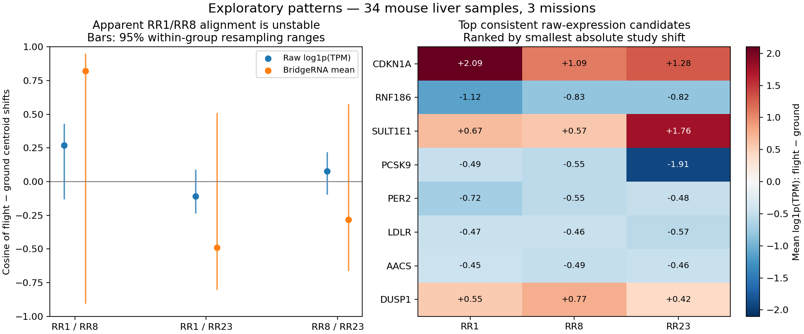

# Fall BridgeRNA liver pattern survey

Completed September 11, 2026. The frozen model ran successfully on **34 mouse liver
samples from three missions**. The useful outcome is a short list of exploratory
gene-level candidates and evidence that the mean-pooled embedding response is
unstable across these small, heterogeneous cohorts. No model advantage or
spaceflight mechanism is established.



## Model and execution

The run used `r7hnr92k`, the latest checkpoint available in the local Fall bundle
and the only checkpoint configuration found in the author's inspected
[`sample_embeddings` branch](https://github.com/alwalt/bridge-rna/tree/ddf5e4bd1e48692dbc41caead413d6ca56154fca).
Its config and canonical vocabulary match the author's files byte-for-byte. This
identifies the available public model; it does not establish whether the author
has newer unpublished weights.

The original draft inference implementation incorrectly placed normalization after
the attention/FFN blocks. The official implementation uses pre-normalization. This
was corrected before this pilot. On full-length masked and unmasked inputs, the
corrected draft and official model agreed exactly in tested float32 outputs;
a repeated sample also agreed exactly. We generated the reported embeddings with
the official implementation, not an unchecked reconstruction.

The checkpoint hash is
`f3491beaa697a0408dc1daeb6f8d648566bd46bafc6e44938d723e7ffc325541`.
Official inference source revision:
`ddf5e4bd1e48692dbc41caead413d6ca56154fca`.

`moe-reboot` was restarted to resolve its NVIDIA driver mismatch. Its A100 40 GB
then passed a CUDA check. The 34 unmasked, 512-dimensional embeddings took about
**12 seconds**, with median **0.326 seconds/sample** and **0.56 GiB peak allocated
CUDA memory** during extraction, excluding the preceding parity checks. The job
is complete; no training was performed. `moe-reboot2` was not restarted or used.

## Cohort and preprocessing

| Study / mission | Selected subgroup | Ground | Flight |
|---|---|---:|---:|
| OSD-48 / RR1 | C subgroup; female C57BL/6J | 5 | 5 |
| OSD-379 / RR8 | Young, ISS termination; female BALB/cAnNTac | 6 | 6 |
| OSD-463 / RR23 | Male C57BL/6J; first technical replicate where present | 6 | 6 |

Only exact Space Flight/Ground Control labels were used. Sample selection was
fixed from metadata before comparing expression or embeddings, with lexicographic
caps per condition and one measurement per named animal. All three source count
files measure every canonical mouse gene. Counts were mapped by stable Ensembl ID,
normalized with mouse exon lengths over the canonical 15,165-gene universe, and
log-transformed once. No gene-value standardization was applied before the model.

All selected samples passed finite/nonnegative counts and positive-denominator
checks; 12,278–13,247 canonical genes had nonzero counts per sample. We did not
apply the summer 14,000-nonzero threshold to this different input contract.
OSD-137 was inspected as an initial candidate but excluded before biological
comparisons because its older count file lacked ten canonical stable IDs. GTEx
was not used; its 509 unmatched symbols remain a separate human-reference issue.

Study source pages: [OSD-48](https://osdr.nasa.gov/bio/repo/data/studies/OSD-48),
[OSD-379](https://osdr.nasa.gov/bio/repo/data/studies/OSD-379),
[OSD-463](https://osdr.nasa.gov/bio/repo/data/studies/OSD-463).

## What the survey shows

### 1. Study differences remain larger than the measured condition component

In a descriptive sum-of-squares decomposition, study means account for **54.1%**
of embedding variance, compared with **68.7%** of raw-expression variance. The
within-study condition component accounts for **9.1%** and **7.0%**, respectively.
These are fractions within different feature spaces, not causal variance estimates
or proof that the model removed batch effects. Sex, strain, preservation, assay,
and mission differences remain entangled with study.

### 2. The apparent shared embedding response is not yet reproducible

| Flight-minus-ground contrast pair | Raw cosine | BridgeRNA cosine |
|---|---:|---:|
| RR1 / RR8 | +0.269 | +0.823 |
| RR1 / RR23 | −0.108 | −0.489 |
| RR8 / RR23 | +0.079 | −0.282 |

The strong RR1/RR8 point estimate is attractive but fragile: its embedding cosine
ranges from **−0.904 to +0.953** across the central 95% of 500 within-condition
animal bootstrap resamples. Every pair's range spans zero. These are conditional
resampling diagnostics, not study-level confidence intervals; cage dependencies
are unknown. The male RR23 cohort differs from the two female cohorts in multiple
ways, so the result does not establish a sex-specific response.

### 3. Several expression-level candidates deserve targeted follow-up

The following changes have the same direction in all three selected cohorts.
Values are differences in mean **log1p(TPM)**, not log2 fold changes.

| Candidate | RR1 | RR8 | RR23 | Follow-up interpretation |
|---|---:|---:|---:|---|
| CDKN1A | +2.09 | +1.09 | +1.28 | Cell-cycle/stress-response candidate |
| DUSP1 | +0.55 | +0.77 | +0.42 | Recurrent expression candidate |
| RNF186 | −1.12 | −0.83 | −0.82 | Recurrent expression candidate |
| LDLR | −0.47 | −0.46 | −0.57 | Lipid-regulation candidate |
| PCSK9 | −0.49 | −0.55 | −1.91 | Lipid-regulation candidate; less precise in RR1 |
| PER2 | −0.72 | −0.55 | −0.48 | Circadian/timing candidate; less precise in RR1/RR8 |

The functional labels are hypotheses informed by known gene biology, not pathway
results from this pilot: [CDKN1A annotation](https://www.ncbi.nlm.nih.gov/gene/1026),
[experimental PCSK9/LDLR work in mice](https://pmc.ncbi.nlm.nih.gov/articles/PMC556275/),
and [mouse Per2 circadian-expression work](https://pubmed.ncbi.nlm.nih.gov/9619629/).
Mouse measurements are displayed using their canonical human ortholog symbols.
Transcript changes do not establish protein activity or cholesterol changes.

CDKN1A, DUSP1, RNF186, and LDLR retain their direction across all three studies'
central 95% within-group resampling ranges. However, genes were selected from
these same data, with no multiple-testing correction; these are candidate rankings,
not significant discoveries. Overall, **3,869/15,165 genes (25.5%)** have a common
sign across three studies, close to the simple 25% independent symmetric-sign
reference. That count itself supplies no evidence of a global shared program.

### 4. A fixed study-held-out probe gives no model advantage

A fixed logistic probe used training-only scaling and, for PCA, training-only
PCA fitting. No hyperparameters or seeds were selected. AUROCs:

| Held-out study | Raw expression | PCA8 | BridgeRNA mean |
|---|---:|---:|---:|
| OSD-48 | 0.440 | 0.480 | 0.360 |
| OSD-379 | 0.694 | 0.861 | 0.639 |
| OSD-463 | 0.556 | 0.444 | 0.250 |
| Unweighted study mean | 0.563 | 0.595 | 0.416 |

This small, untuned development probe is a diagnostic rather than a definitive
benchmark. BridgeRNA mean pooling did not outperform raw expression on any of the
three held-out studies. These values should not be compared directly with summer
scores from a different cohort and evaluation protocol.

## Recommended next experiment

Keep the checkpoint frozen. Expand the same three matched subgroups to all eligible
animals and test whether the candidate gene shifts and the unstable RR1/RR8 geometry
persist. Audit animal/cage identity, preservation, library prep, and collection time
before adding another independent liver mission. Specifically investigate whether
PER2 and related candidates track collection timing, and whether CDKN1A and the
lipid-related candidates recur after those checks.

Then inspect prespecified gene/module-level contextual representations against the
same expression controls, since global mean pooling has no demonstrated advantage
here. Select neither a favorable layer nor a new architecture from this small
survey. No fine-tuning or MoE expansion is warranted by the current results.

## Reproduce and inspect

Scripts: `fa26/osdr_pattern_pilot.py`, `fa26/pilot_robustness.py`.
The official source is cached under ignored `fa26/bridge-rna-latest/upstream_embeddings`;
fetch the pinned revision above when restoring the workspace. The preprocessing
contract follows the canonical-first normalization in the author's main-branch
`preprocessing.py` at revision `747a5143fa2dcb087ee0bbf3900bbdacf42f9059`.
The inference adapter's generic TPM helper can normalize a broader input universe;
we explicitly use the training canonical universe here.

```bash
python3 fa26/osdr_pattern_pilot.py prepare --output <new-output-directory>
python3 fa26/osdr_pattern_pilot.py infer --output <new-output-directory>
python3 fa26/osdr_pattern_pilot.py analyze --output <new-output-directory>
python3 fa26/pilot_robustness.py --output <new-output-directory>
python3 -m pytest -q fa26/tests
```

Ten focused tests pass. The real full-length official-source comparisons and repeated
sample check are recorded in `inference_report.json`. `protocol.json`, `manifest.csv`,
`candidate_decisions.csv`, `input_audit.json`, and `sample_qc.csv` document inputs and
selection. CSVs contain every contrast, prediction, and gene ranking. PNG/PDF figures
and compressed input/embedding arrays are retained beside this report.

VM run directory:
`/media/volume/moe-reboot/fa26_pattern_pilot_20260911`.
Earlier GTEx outputs discovered in the separate `fa26_bridge_inference` directory
were not used and remain unverified, because they predate the forward-pass correction.
