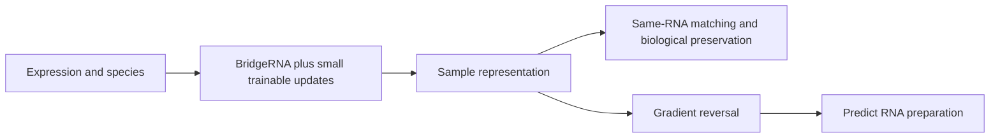

# First fine-tuning pipeline: technical robustness, then interpretable flight prediction

Updated September 14, 2026 from the PI discussion and the linked [BridgeRNA benchmark branch](https://github.com/alwalt/bridge-rna/tree/ddf5e4bd1e48692dbc41caead413d6ca56154fca/benchmarks).

**Research question A:** can adaptation reduce sensitivity to RNA preparation without destroying biological information?

**Research question B:** can an adapted representation recognize a defined spaceflight/stress condition and identify which genes and pathways support its prediction?

The two questions have separate datasets, losses and evaluation gates. This document specifies the proposed pipeline; no new inference, fine-tuning or classifier results are claimed. The [benchmark source review](../artifacts/bridge_benchmark_audit_2026-09-14/REVIEW.md) records what already exists upstream.

## 1. Define the dataset roles and outputs first

| Data | Role | Independent unit / limit |
|---|---|---|
| Chen paired poly(A)/Ribo T cells | Technical adaptation and donor-held-out development | 40 donors / 80 paired profiles; one study and one cell type |
| Zhao SRP127360 blood/colon | External technical challenge | 2 source RNAs / 16 libraries; technical replicates are not extra biological N |
| RR1 OSD-48 ↔ OSD-168 | Protocol-change flight-response challenge | Author's exact 9 matched animals; preparation and other protocol changes co-occur |
| RR3 OSD-137 ↔ OSD-168 | Same-preparation remeasurement preservation | 4 matched animals each at 39 and 40 days |
| Multi-study, multi-tissue reference | Tissue retention and general representation check | Hold out studies; animal/donor links must cross no split |
| Verified flight/ground cohorts | First prediction head | Hold out missions/studies, group animals and keep control types explicit |
| Isolated irradiation and gravity-perturbation experiments | Later stress-specific heads | Only once exposure, controls, dose/time and grouping are verified |

The author data descriptions identify the controlled benchmark; raw matrices, pairing and input compatibility still need local preparation verification. Do not relabel all OSD-168 records as poly(A) pairs. GSE150097 remains only a pairing candidate. The matched challenge has 17 animals/34 profiles; the earlier 18-animal local inventory was a broader candidate set.

Every manifest should retain `sample_id`, `biological_unit_id`, `dataset`, `study`, `mission`, `species`, `tissue`, `strain`, `library_prep`, `processing_source`, `paired_rna_id`, `control_type`, exposure/dose/duration, outcome-label provenance and split role. Unknown exposure labels are **unknown**, not negative examples.

## 2. Freeze the benchmarks before adapting the encoder

Reproduce the relevant author's saved baselines on identical membership and gene mapping. Compare:

- **Expression and train-fitted PCA**, evaluated with the same probes/retrieval tasks.
- **Frozen BridgeRNA**, including final mean+SD and the relevant layer/readout baselines already studied upstream.
- **A simple correction baseline** and the existing frozen-embedding adversarial projection, with their known limitations retained.

Use identical sample embeddings for plots colored by preparation, tissue, mission and flight condition. PCA/UMAP is a visual diagnostic; projections cannot be selected for attractive mixing. Any ComBat-style all-data integration is labeled transductive/descriptive and kept separate from inductive held-out evaluation.

Batch success requires both lower preparation leakage and improved or retained **same-RNA matching on unseen donors**. Pair distance alone is insufficient because a constant embedding could make every pair close; test retrieval, between-donor discrimination, variance/effective rank and biological endpoints together. Fit scalers, PCA, corrections, heads and selection rules only on the applicable training fold.

## 3. How we will fine-tune for technical robustness

First reuse frozen layers 11/12 and their saved results; add a limited earlier-layer diagnostic if needed. Layer selection asks where useful information resides. LoRA or block unfreezing specifies which parameters can change. Neither is itself a batch-removal objective.

Proposed minimum comparison:

| Arm | Trainable parameters | Purpose |
|---|---|---|
| A0 | No encoder updates; same evaluation heads | Frozen baseline |
| A1 | Small projection/disentanglement heads on frozen embeddings | Reproduce the existing head-only approach |
| A2 | LoRA + preservation/pair objectives; no adversary | Control for adaptation alone |
| A3 | Identical LoRA + preservation/pair objectives + batch adversary | Test the incremental benefit of active batch suppression |
| A4, conditional follow-up | Last transformer block, optionally last two; same losses | Compare update strategies if A2/A3 warrant further testing |

Proposed initial LoRA: rank 8 on attention query/value projections, with original weights frozen. This is an economical starting configuration, not a claim of optimality. Verify trainable parameter names/counts and nonzero gradients. Keep normalization, missing-gene policy, vocabulary and species handling fixed. Our current inference `encode()` disables gradients; fine-tuning needs a separate gradient-enabled path, without changing the frozen baseline implementation.

For embedding `z = pool(encoder(x))`:

The preparation classifier minimizes its classification loss normally. Encoder updates minimize preservation and pair losses while **maximizing the batch classifier's loss**, implemented by reversing its gradient. Begin with a weak adversarial contribution and a small development-only schedule; do not make every sample identical.

Pairing must preserve between-donor variation. Use paired matching/retrieval with negatives or an explicit variance/preservation term, not only positive-pair cosine. If reconstruction is used, account for its incentive to reconstruct batch too: a batch-conditioned decoder is a candidate, with a defined unknown-batch policy; copying uncorrected expression is not automatic biological preservation. A tissue head requires multi-tissue training data and cannot be learned from the T-cell cohort alone. Use a separate multi-tissue preservation set or a properly split auxiliary training reference.

The upstream adversarial approach only trained MLPs on cached embeddings. A3 instead tests whether changing the encoder's representation helps. [Gradient-reversal precedent](https://www.jmlr.org/beta/papers/v17/15-239.html), [LoRA method](https://arxiv.org/abs/2106.09685), and [scGPT's integration example](https://github.com/bowang-lab/scGPT/blob/main/examples/finetune_integration.py) motivate components; none guarantees success here. Fourier transformations are not required for this pilot.

## 4. Size, splits and the technical success gate

The initial controlled benchmark has **40 independent donor pairs**, not thousands of independent examples. Use nested donor-held-out development, keeping both protocols together. Within outer training folds, compare nested subsets such as 10/20/all available training donors, only when each subset supports the intended evaluation. Plot performance against donors actually used. Do not label within-study donor validation as unseen-study validation.

Use the same subsets, a small frozen configuration budget and fixed seeds (17, 42, 101) across adaptation arms. Keep the two-source external dataset as a small challenge. Broader validation will need additional independent studies/tissues, particularly for human-to-mouse transfer. All currently inspected upstream outcomes are development evidence, not an untouched confirmation set.

Advance only if preparation leakage falls under fresh held-out linear and nonlinear probes while same-RNA matching and biological preservation remain acceptable. For binary preparation prediction, report orientation-free discrimination too: AUC 0 can represent a fully inverted classifier, not erased batch information. Check uncertainty by biological unit.

Preserve reproducible RR3 remeasurement responses and tissue utility; investigate RR1 without forcing its cosine positive. The author's PC1–2 removal changes RR1 from −0.804 to +0.221 but damages RR3-39 (0.790 → 0.480). That is an explicit failure mode to avoid. Select hyperparameters on controlled development data, not by improving a favored RR1 picture. Numerical acceptance/non-inferiority margins must be frozen after baseline variability and eligible data are measured, before adaptation outcomes are examined.

## 5. Add prediction heads for a defined spaceflight question

After the technical gate—or in a parallel frozen-head baseline with no correction claim—start with the narrow question **flight versus its specified matched ground control** in a supported tissue/context. Do not initially combine basal, vivarium, ground-hardware and onboard-1g controls into one undifferentiated label. An onboard-1g sample was in space; it is not a negative label for “ever flew,” although it can be a control for a microgravity-treatment head.

Train a regularized linear head first, then a small MLP as the nonlinear comparator, with the encoder fixed. Only compare additional LoRA or last-block updates if the head-only result and sample size justify it. Cross the key factors where feasible: original/adapted encoder × same head and split. Preserve the adaptation benchmark as a regression check during biological fine-tuning.

| Head / output | Required supervision | Supported interpretation |
|---|---|---|
| Flight-associated state | Verified flight/control context and independent study splits | Similarity to labeled flight-associated expression patterns |
| Microgravity exposure | Appropriate microgravity versus 1g/analog controls; analogs labeled separately | Prediction of the defined gravity-treatment condition |
| Irradiation exposure | Known radiation/sham, dose, particle type and timing | Prediction of the trained irradiation condition |
| Mitochondrial dysfunction/response | Independent functional phenotype or externally justified annotation | Prediction of that phenotype, within its validation domain |
| Mitochondrial or DNA-damage gene-set score | Expression-derived pathway labels only | Descriptive signature score; not independent proof of dysfunction or exposure |

Gravity and radiation can co-occur. Use separate sigmoid heads with masked missing labels, rather than a softmax forcing exclusive causes, unless the experiment truly defines mutually exclusive classes. Start with the flight head because current survey labels support that question. A binary flight head alone cannot identify radiation versus microgravity as the cause of a response.

For probabilities, reserve grouped validation data for calibration and report reliability/Brier score alongside discrimination and uncertainty. **“Radiation probability 0.80” is permissible only as a calibrated prediction of a defined radiation label in a supported domain. It does not mean 80% of the sample's stress was caused by radiation.** In unsupported tissues/exposures, flag the prediction as outside the validated domain or abstain. An uncalibrated sigmoid is a score, not a demonstrated probability.

## 6. Explain what the classifier used

For each supported prediction, report the signed genes and pathways contributing to the selected logit. Use input Integrated Gradients with documented reference baselines; check more than one biologically reasonable baseline. Layer activations/attention are exploratory diagnostics, not causal gene explanations.

Validate attribution across held-out animals/studies and seeds, and compare gene deletion/occlusion against expression-matched random gene panels. Use small perturbations/sensible masking and disclose off-manifold effects. Aggregate gene contributions into predefined pathways with the correct observed-gene background; report overlaps and instability. Test whether attributions change with preparation and whether they remain consistent across same-RNA pairs. Evaluate a raw-expression classifier's attributions alongside BridgeRNA's.

A future per-sample report would contain: the exact target/contrast, calibrated probability or uncalibrated-score status, validation-domain flag, leading positive/negative model-attributed genes, pathway associations, and preparation-sensitivity checks. This answers **“what evidence did the model use?”** It does not establish that the attributed genes caused the biological response. Mitochondrial signatures may support a hypothesis even when exposure-specific causal identification is not possible.

## 7. Return to the biological survey

With the selected model frozen again, repeat the same sample-removal, remeasurement, cross-study and controlled-flight analyses. Retain failed cases, particularly RR3 preservation and the weaker endothelial comparison. Compare with expression/PCA and the original checkpoint. Raw-expression gene-set scores will not change merely because encoder weights changed; model-based attribution and classification are new endpoints and must be labeled accordingly.

The first deliverable is a technical benchmark table and controlled pair/probe plots. The second is a supported flight-classification case with calibration and attribution checks. Radiation/microgravity-specific heads are later extensions when suitable labels and controls are available. Full-model tuning, large rank/layer sweeps and a universal stress-cause predictor are not prerequisites for this first test.

## Immediate implementation order

1. Prepare Chen/Zhao inputs and reuse the author's explicit RR1/RR3 mappings; verify raw-file access, pairing, canonical coverage and preprocessing differences before inference.
2. Reproduce the small frozen/PCA/head-only baselines and freeze grouped evaluation folds.
3. Implement one LoRA configuration with the A2/A3 adversarial ablation and gradient checks; measure the technical/biological tradeoff.
4. Audit a flight classification cohort and train the same regularized prediction head on original/adapted embeddings.
5. Add probability calibration and attribution validation after out-of-study prediction is credible; extend exposure targets only with valid supervision.

No training was launched while writing this plan. The linked benchmark gives us actionable controlled-data sources and existing baselines; any additional mentor dataset will be audited when supplied.
